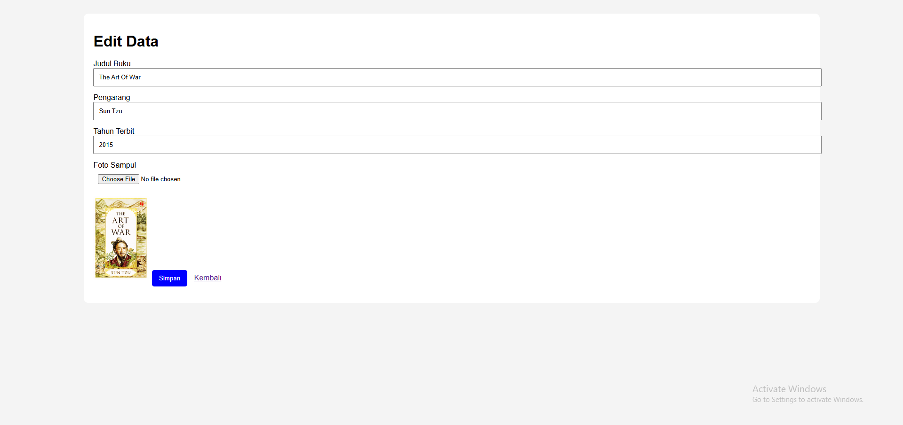

# Aplikasi CRUD Data Buku

Aplikasi CRUD sederhana menggunakan:

- HTML
- CSS
- JavaScript
- PHP Native
- MySQL

## Fitur

- Tambah Data
- Edit Data
- Hapus Data
- Upload Foto
- Validasi JavaScript

## Preview Aplikasi

### Halaman Utama


### Halaman Form


### Halaman Edit




## Database

File database tersedia pada:

```bash
db_buku.sql

# Cara Menjalankan Project

## 1. Pindahkan Folder Project

Pindahkan folder project ke direktori:

```bash
C:/laragon/www/
```

Contoh:

```bash
C:/laragon/www/UTS
```

---

## 2. Jalankan Laragon

Buka aplikasi Laragon lalu klik:

- Start All

Pastikan:
- Apache Running
- MySQL Running

---

## 3. Import Database

1. Buka phpMyAdmin:

```bash
http://localhost/phpmyadmin
```

2. Buat database baru dengan nama:

```bash
db_buku
```

3. Klik tab Import

4. Upload file:

```bash
db_buku.sql
```

5. Klik Go

---

## 4. Jalankan Project

Buka browser lalu akses:

```bash
http://localhost/UTS
```

---

## 5. Login Database Default

```bash
Host     : localhost
Username : root
Password :
Database : db_buku
```